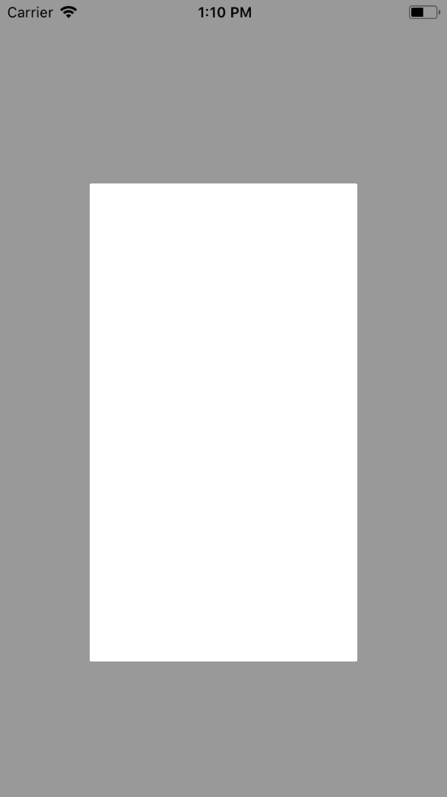

Modal View - Pop Up
===

## Descripción

 A continuación presentamos un método para mostrar una ventana modal tipo pop up, con Swift 4 y Xcode 9.2.

<p align="center">
	
</p>

## Source

Hicimos uso de el pod <a href="https://github.com/daisuke310vvv/PopupController">PopupController</a> no hubo necesidad de instalar el pod, sólo tomamos la clase *PopupController* que hace uso de *UIView.animated* para hacer las animaciones, si nos otros quisieramos hacer una implementación simple podríamos hacer uso del protocolo *UIViewControllerAnimatedTransitioning*.

1. Copiamos la clase *PopupController.swift*

2. Creamos una nueva clase que herede de *ViewController* y seleccionamos que nos la cree con un .xib, por ejemplo: *SeraViewController*

3. Agregamos un boton al *ViewController* inicial

4. Dentro de *SeraViewController* agregamos la implementación de *PopupController* donde sólo nos pedirá implementar el tamaño. En mi caso tomo las medidas de la pantalla y le digo que solo tome el 60%

```swift
//
//  SeraViewController.swift
//  pruebaPod2
//
//  Created by Gmo Ginppian on 21/12/17.
//  Copyright © 2017 BUAP. All rights reserved.
//

import UIKit

class SeraViewController: UIViewController {

    override func viewDidLoad() {
        super.viewDidLoad()
        // Do any additional setup after loading the view.
    }

}

extension SeraViewController: PopupContentViewController {
    
    func sizeForPopup(_ popupController: PopupController, size: CGSize, showingKeyboard: Bool) -> CGSize {
        return CGSize(width: UIScreen.main.bounds.width * 0.6, height: UIScreen.main.bounds.height * 0.6)
    }
}
```

5. Posterior en el método click del boton, instanciamos *SeraViewController* y lo mostramos

```swift
//
//  ViewController.swift
//  pruebaPod2
//
//  Created by Gmo Ginppian on 21/12/17.
//  Copyright © 2017 BUAP. All rights reserved.
//

import UIKit

class ViewController: UIViewController {

    override func viewDidLoad() {
        super.viewDidLoad()
        // Do any additional setup after loading the view, typically from a nib.
    }

    @IBAction func actContinue(_ sender: UIButton) {
        
        let vc = SeraViewController()
        PopupController
            .create(self)
            .customize(
                [
                    .animation(.slideUp),
                    .layout(.center)
                ]
            )
            .didCloseHandler { _ in
                // Do something when close...
            }
            .show(vc)
    }
}
```

Y se verá una vista modal (reducida con fondo transparente) estilo pop up =D

Si queremos customizarlo podemos hacer cambios directamente a la clase *PopupController* o consultar la documentación del pod.

## Fuente

* <a href="https://github.com/daisuke310vvv/PopupController">Pod: PopupController</a>